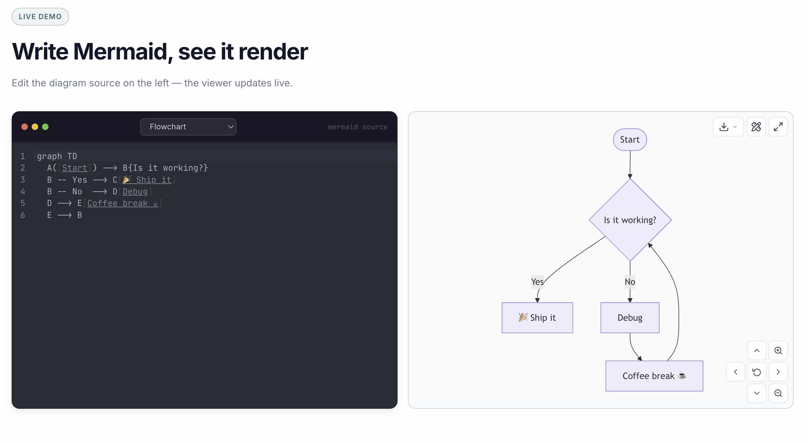

# @avol-io/react-mermaid
<a href="https://www.avol.io/react-mermaid" target="_blank" rel="noopener noreferrer"></a>

> React component that renders [Mermaid](https://mermaid.js.org/) diagrams with zoom, pan, directional controls, fullscreen, download, and draw.io integration.

[](https://www.avol.io/react-mermaid/)
[](https://www.npmjs.com/package/@avol-io/react-mermaid)
[](https://github.com/avol-io/2chatty/blob/main/LICENSE)

---

## Installation

```bash
npm install @avol-io/react-mermaid
```

### Peer dependencies

```bash
npm install react react-dom mermaid react-zoom-pan-pinch
```

| Package | Required version |
|---|---|
| `react` | `>=19` |
| `react-dom` | `>=19` |
| `mermaid` | `>=11` |
| `react-zoom-pan-pinch` | `>=3` |

---

## Usage

```tsx
import { MermaidDiagram } from '@avol-io/react-mermaid'

export function App() {
  return (
    <MermaidDiagram
      chart={`
        graph TD
          A[Start] --> B{Decision}
          B -- Yes --> C[Done]
          B -- No  --> D[Skip]
      `}
      width="100%"
      height="400px"
    />
  )
}
```

---

## API

### MermaidDiagram

| Prop | Type | Default | Description |
|---|---|---|---|
| `chart` | `string` | required | Mermaid source text |
| `width` | `string` | `"100%"` | CSS width of the container |
| `height` | `string` | `"400px"` | CSS height of the container |
| `config` | `MermaidConfig` | — | Options forwarded to `mermaid.initialize()` |
| `enableDownloadSvg` | `boolean` | `true` | Show "SVG" option in the download dropdown |
| `enableDownloadMmd` | `boolean` | `true` | Show ".mmd" option in the download dropdown |
| `enableDrawio` | `boolean` | `true` | Show "Open in draw.io" button in the toolbar |

> When both `enableDownloadSvg` and `enableDownloadMmd` are `false`, the download
> dropdown button is not rendered at all.

### Modal

| Prop | Type | Default | Description |
|---|---|---|---|
| `title` | `string` | `"Error"` | Modal heading |
| `onClose` | `() => void` | required | Called on Escape, overlay click, or close button |
| `children` | `ReactNode` | required | Modal body content |

---

## Toolbar

### Top-right
- **Download** — dropdown with SVG and `.mmd` options (each independently toggleable via props)
- **Open in draw.io** — opens [app.diagrams.net](https://app.diagrams.net) with the diagram preloaded via Mermaid import URL
- **Fullscreen** — toggles a fixed fullscreen overlay

### Bottom-right (3×3 grid)
- **Arrow buttons** — pan the diagram in all four directions
- **Center button** — resets the view to fit the content in the container
- **Zoom in / Zoom out** — step zoom (wheel zoom also supported, follows the cursor)

---

## Styling

No CSS import required. On first render a `<style id="avol-react-mermaid-styles">` tag is injected
into `<head>` once and reused by all instances.

All colors and sizes are exposed as **CSS custom properties**. Override them on `:root` for a
global theme, or scope to a container class for per-instance theming:

```css
/* dark theme example */
:root {
  --mermaid-bg: #1f2937;
  --mermaid-border-color: #374151;
  --mermaid-toolbar-bg: rgba(17, 24, 39, 0.9);
  --mermaid-toolbar-color: #f9fafb;
  --mermaid-toolbar-hover-bg: #111827;
  --mermaid-toolbar-border: #4b5563;
  --mermaid-fullscreen-bg: #111827;
  --mermaid-dropdown-bg: #1f2937;
  --mermaid-dropdown-item-color: #f3f4f6;
  --mermaid-dropdown-item-hover: #374151;
}
```

### Available tokens

| Token | Default | Controls |
|---|---|---|
| `--mermaid-bg` | `transparent` | container background |
| `--mermaid-border-color` | `rgba(0,0,0,0.12)` | container border color |
| `--mermaid-border-radius` | `8px` | container corner radius |
| `--mermaid-toolbar-bg` | `rgba(255,255,255,0.9)` | button background |
| `--mermaid-toolbar-border` | `rgba(0,0,0,0.12)` | button border |
| `--mermaid-toolbar-color` | `#374151` | button icon/text color |
| `--mermaid-toolbar-hover-bg` | `#ffffff` | button hover background |
| `--mermaid-toolbar-hover-shadow` | `0 2px 8px rgba(0,0,0,0.1)` | button hover shadow |
| `--mermaid-toolbar-focus-ring` | `#01696f` | focus outline color |
| `--mermaid-toolbar-btn-size` | `30px` | button width & height |
| `--mermaid-toolbar-btn-radius` | `6px` | button corner radius |
| `--mermaid-dropdown-bg` | `#ffffff` | dropdown panel background |
| `--mermaid-dropdown-border` | `rgba(0,0,0,0.1)` | dropdown border |
| `--mermaid-dropdown-shadow` | `0 4px 12px rgba(0,0,0,0.12)` | dropdown shadow |
| `--mermaid-dropdown-item-hover` | `#f3f4f6` | dropdown item hover background |
| `--mermaid-dropdown-item-color` | `#374151` | dropdown item text color |
| `--mermaid-error-bg` | `#fef2f2` | error banner background |
| `--mermaid-error-border` | `#fecaca` | error banner border |
| `--mermaid-error-color` | `#dc2626` | error banner text |
| `--mermaid-fullscreen-bg` | `#ffffff` | fullscreen overlay background |
| `--mermaid-fullscreen-zindex` | `9998` | fullscreen z-index |

---

## Live docs

https://www.avol.io/react-mermaid/

---

## License

MIT &copy; [avol.io](https://avol.io)